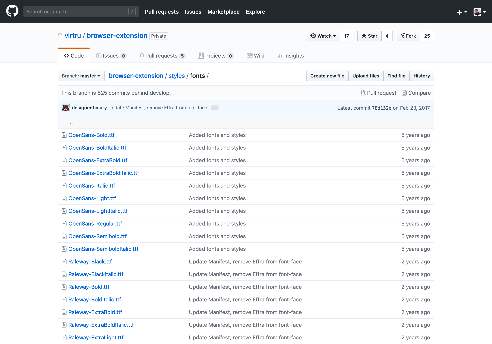
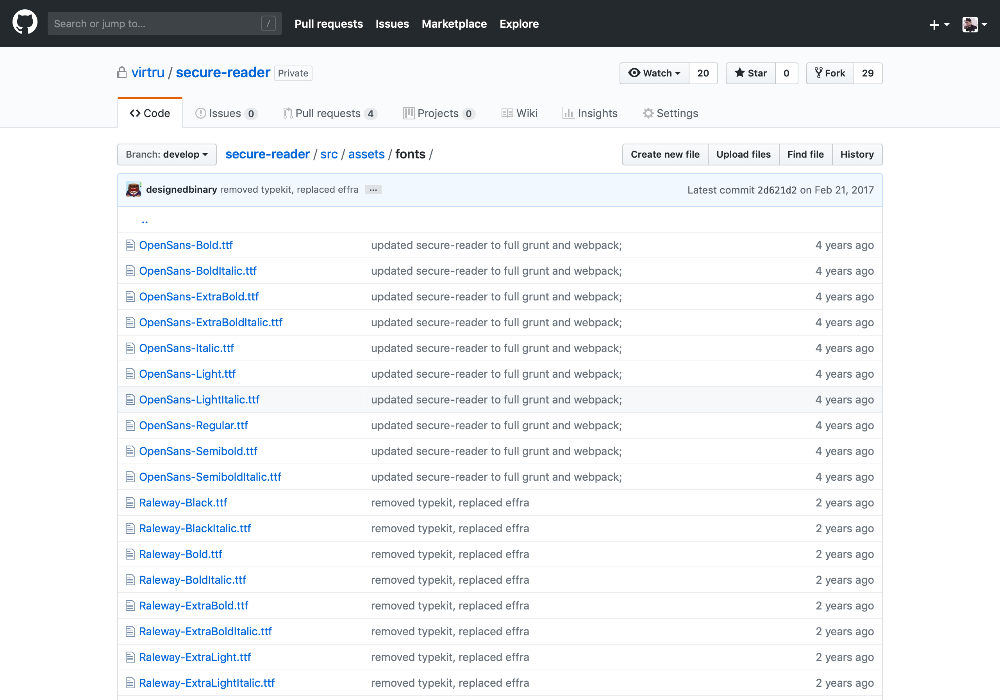
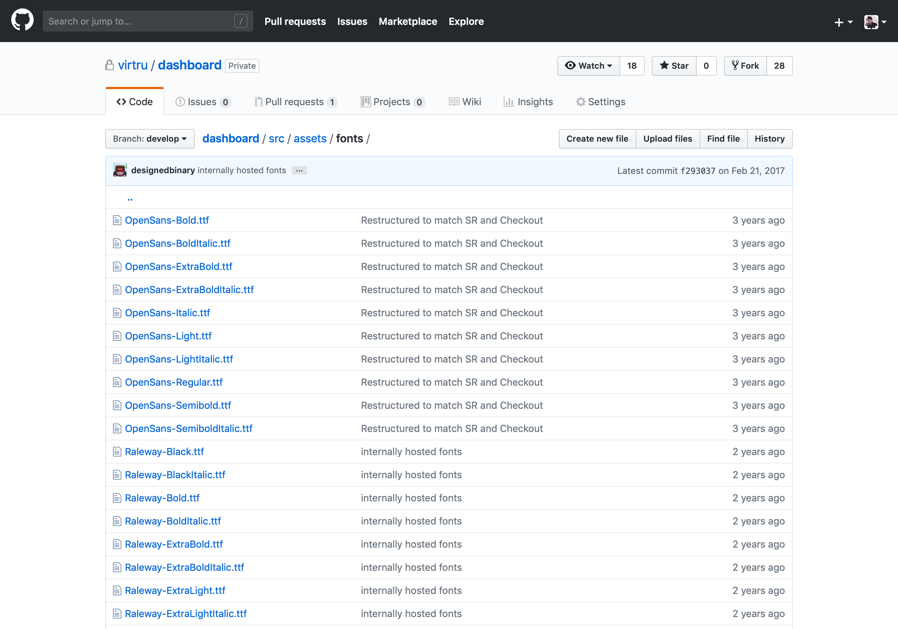
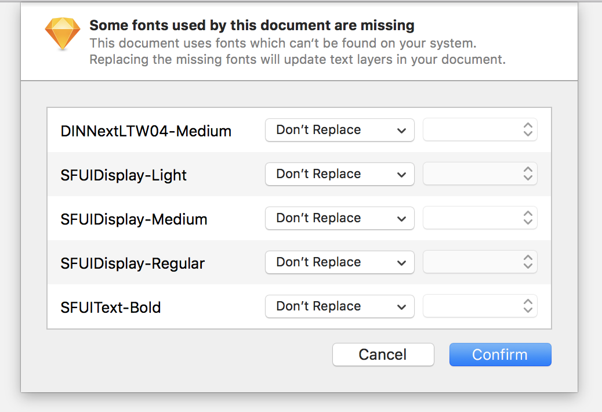

# Virtru Typography

One, consistent set of fonts for the Virtru brand to be used by designers and engineers across our products.

## What problems does this solve?

### 1. DRY—duplication of font assets

These are the same fonts repeated again and again:

A. A Browser Plugin

B. Secure Reader

C. Dashboard

### 2. The same fonts coming from different sources

Where is this coming from? Which is canonical?

### 3. Design programs treating the same fonts as different fonts, locally

### 4. New designer onboarding—how do I get fonts locally?

As of 2018, undocumented and thus, inconsistent.

# Intro for Designers 

TBD by design

# Intro for Engineers

TBD by engineering

## Install & Build

